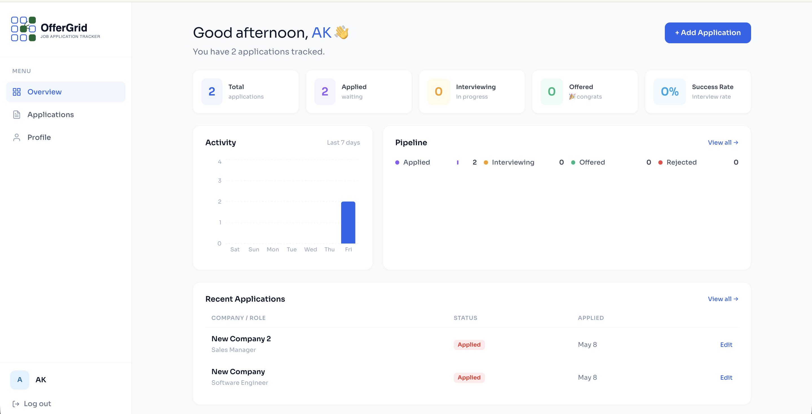
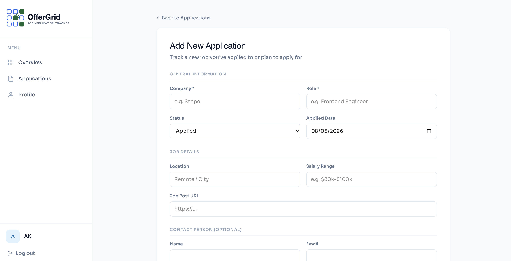

# OfferGrid - Job Application Tracker

**OfferGrid** is a full-stack application designed to help job seekers centralize, manage, and visualize their job search journey. It transforms the chaotic process of job hunting into a structured, data-driven workflow.

> **Branch information**
> - `main` – base application (may call backend directly, suitable for same‑domain hosting).
> - `deployment-branch` – configured for cross‑domain deployment (frontend on Vercel, backend on Render) using Next.js API routes as proxies.
> 
> The proxy pattern described below is **only required** when frontend and backend are on different domains (e.g., Vercel + Render). If both are on the same domain, you can call the backend directly without proxies.

---

### 🔗 Live Demo
* **Frontend:** [https://job-tracker-five-woad.vercel.app/](https://job-tracker-five-woad.vercel.app/)
* **Backend API:** [https://job-tracker-backend-k8kj.onrender.com/](https://job-tracker-backend-k8kj.onrender.com/)

---

## Key Features

* **Secure Authentication:** JWT-based session management using HttpOnly, Secure
* **Job Management (CRUD):** Full capability to add, edit, track, and delete job applications.
* **Admin Dashboard:** Specialized views for administrative users to manage user roles and system-wide data.
* **Visual Analytics:** Data visualization of application statuses and monthly trends using Recharts.
* **Responsive UI:** Optimized for both desktop and mobile viewing with a clean, professional aesthetic.

---

## 📁 Project Structure

```text
job-tracker/
├── app/                         # Next.js frontend (App Router)
│   ├── api/                     # API proxy routes (forward requests to backend)
│   ├── (routes)/                # Pages (login, dashboard, admin, etc.)
│   └── ...
├── backend/                     # Express backend
│   ├── models/                  # MongoDB models (User, Job, etc.)
│   ├── routes/                  # API routes (user, job, status, etc.)
│   ├── middleware/              # Auth, error handling
│   ├── server.js                # Entry point
│   └── .env                     # Backend environment variables
├── public/                      # Static assets
├── middleware.ts                # Next.js middleware (protected routes)
└── ...
```
---

## Tech Stack

### Frontend
- **Framework:** Next.js (App Router)
- **Language:** TypeScript
- **Styling:** Tailwind CSS
- **State Management:** React Hooks (Context API)
- **Icons:** Lucide React

### Backend
- **Environment:** Node.js / Express
- **Database:** MongoDB / Mongoose
- **Security:** Bcrypt (password hashing), JWT (tokens), CORS (production-grade configuration)
- **Deployment:** Render (with Proxy Trust configuration)

---

# Local Development Setup

## Prerequisites

- Node.js (v18+)
- MongoDB Atlas account (or local MongoDB)
- Git

---

## 1. Clone the Repository

```bash
git clone https://github.com/AungKhantKyaw/job-tracker.git
cd job-tracker
```

---

## 2. Backend Setup

```bash
cd backend
cp .env.example .env
npm install
npm run dev
```

Backend runs on:

```text
http://localhost:5002
```

### Backend `.env` Variables

```env
PORT=5002
MONGODB_URI=mongodb+srv://<user>:<password>@cluster.mongodb.net/jobtracker
JWT_SECRET=your_jwt_secret_here
CLIENT_URL=http://localhost:3000
NODE_ENV=development
EMAIL_HOST=...
EMAIL_USER=...
EMAIL_PASS=...
```

---

## 3. Frontend Setup

```bash
cd ..
cp .env.local.example .env.local
npm install
npm run dev
```

Frontend runs on:

```text
http://localhost:3000
```

### Frontend `.env.local` Variables

```env
NEXT_PUBLIC_API_URL=http://localhost:5002
```

> Important: In the deployment-branch, the frontend never calls the backend directly. All requests are proxied through Next.js API routes (/api/*). This ensures cookies work on Vercel and avoids CORS.

---


#  API Proxy Pattern (for cross‑domain deployment only)

All frontend-to-backend communication goes through Next.js API routes, which forward the request and preserve the `Cookie` header.

| Frontend Call | Proxy File | Backend Endpoint |
|---|---|---|
| `POST /api/auth/login` | `app/api/auth/login/route.ts` | `POST /user/login` |
| `POST /api/auth/logout` | `app/api/auth/logout/route.ts` | `POST /user/logout` |
| `POST /api/auth/forgot-password` | `app/api/auth/forgot-password/route.ts` | `POST /auth/forgot-password` |
| `POST /api/auth/reset-password/[token]` | `app/api/auth/reset-password/[token]/route.ts` | `POST /auth/reset-password/:token` |
| `POST /api/user/register` | `app/api/user/register/route.ts` | `POST /user/register` |
| `GET/PUT /api/user/profile` | `app/api/user/profile/route.ts` | `GET /user/profile`, `PUT /user/profile` |
| `GET/POST /api/jobs` | `app/api/jobs/route.ts` | `GET /job`, `POST /job` |
| `GET/PUT/PATCH/DELETE /api/jobs/[id]` | `app/api/jobs/[id]/route.ts` | `GET /job/:id`, `PUT /job/:id`, etc. |
| `GET /api/status` | `app/api/status/route.ts` | `GET /status` |
| `GET/POST /api/admin/users` | `app/api/admin/users/route.ts` | `GET /user`, `POST /user/create` |
| `GET/PUT/DELETE /api/admin/users/[id]` | `app/api/admin/users/[id]/route.ts` | `GET /user/:id`, `PUT /user/:id`, `DELETE /user/:id` |

> If you deploy frontend and backend on the same domain (e.g., both behind a single reverse proxy), you can remove all these proxies and call the backend directly – the cookie will be sent automatically.
---

## Screenshots

### Dashboard



### Application



# Contributing

Pull requests are welcome.

Please:

- Follow the existing code style
- Maintain the API proxy pattern
- Test authentication flows before submitting changes

---

# License

MIT

---

# Acknowledgements

- Next.js
- Express
- MongoDB Atlas
- Vercel
- Render